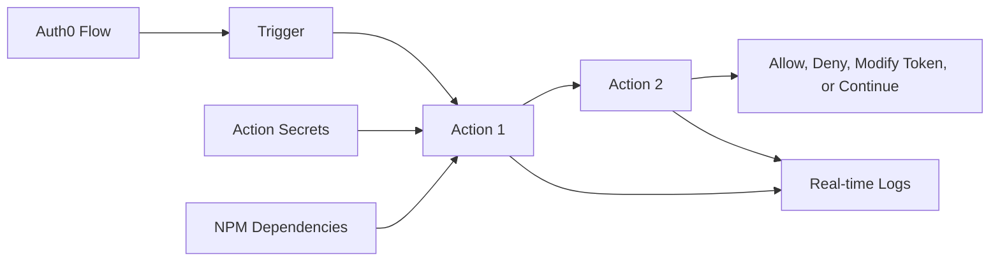

# Actions Code Customization Overview

Auth0 Actions are tenant-specific, versioned Node.js functions that run at supported points in Auth0 flows. This section turns Actions from a feature description into an implementation guide with code patterns, trigger examples, testing practices, dependency guidance, versioning, logging, and migration notes.

## What this section covers

| Page | Purpose |
| --- | --- |
| Write Your First Action | Minimal end-to-end Action structure and deployment workflow |
| Actions Modules and Dependencies | How to structure code and use modules safely |
| Action Coding Guidelines | Production coding standards for reliability and security |
| Trigger Code Library | Copy-ready examples for common enterprise use cases |
| Post Login Trigger | Claims, access decisions, metadata, and MFA examples |
| Pre User Registration Trigger | Signup validation and domain controls |
| Post User Registration Trigger | Downstream notification and profile lifecycle examples |
| Machine to Machine Trigger | Client credentials token customization and denial logic |
| Transaction Metadata | Passing state between Actions in the same transaction |
| Real-time Logs | Debugging and operational troubleshooting |
| NPM, Unit Tests, and Dependencies | Local test approach and dependency controls |
| Versions and Testing | Draft, deployed, rollback, and release practices |
| Migrate Rules and Hooks | Migration patterns from legacy extensibility |

## Action architecture

## Enterprise design principles

- Keep Actions small and single-purpose.
- Keep external calls out of the login path unless the business risk justifies them.
- Use Action secrets for credentials.
- Do not log tokens, passwords, secrets, or full user profiles.
- Treat deployed Action versions as production code.
- Test denial paths, missing metadata, and upstream API failures.
- Monitor Action errors after every release.

## Recommended implementation sequence

1. Select the trigger that matches the use case.
2. Define expected inputs from the `event` object.
3. Define allowed side effects through the `api` object.
4. Write the Action with clear failure behavior.
5. Add secrets and dependencies.
6. Test in the Auth0 editor and with real non-production login flows.
7. Create a version and bind it to the flow.
8. Monitor real-time logs and tenant logs.
9. Promote through configuration management.
