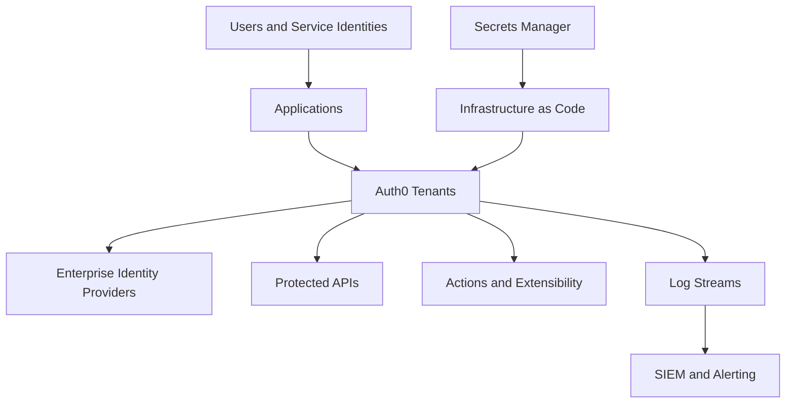

# Enterprise architecture

Enterprise Auth0 architecture defines how identity capabilities are isolated, integrated, secured, automated, and operated across business-critical applications.

## Architecture goals

- Centralize authentication patterns while allowing application teams to move independently.
- Support workforce, customer, partner, and machine identity scenarios.
- Use explicit tenant and environment boundaries.
- Standardize token, session, MFA, and authorization controls.
- Integrate logs and audit events with enterprise monitoring.
- Automate repeatable configuration through governed pipelines.

## Logical architecture

## Core components

| Component | Enterprise responsibility |
| --- | --- |
| Tenant | Runtime and administrative boundary for identity configuration |
| Application | Client configuration for web, mobile, SPA, or service workloads |
| API | Protected resource and token audience definition |
| Connection | Database, social, enterprise, or passwordless identity source |
| Organization | B2B customer or partner boundary for membership and branding |
| Action | Governed extensibility logic for login and token flows |
| Log stream | Operational and security event export |

## Design decisions

Document these decisions before production onboarding:

- Tenant isolation model.
- Environment promotion model.
- Custom domain and certificate ownership.
- Identity provider federation approach.
- Organization and multi-tenant SaaS model.
- Token lifetime and refresh token policy.
- Administrator access and emergency access model.
- Log retention and security monitoring model.

## Control planes

Separate responsibilities into three planes:

| Plane | Examples | Primary owner |
| --- | --- | --- |
| Configuration | Applications, APIs, connections, Actions, tenant settings | Identity platform team |
| Runtime | Authentication flows, token issuance, federation, MFA | Identity platform and application teams |
| Operations | Logging, monitoring, incidents, releases, compliance evidence | Operations and security teams |

## Anti-patterns

- Sharing one production tenant across unrelated regulated workloads without a documented isolation model.
- Changing production configuration directly in the dashboard without later reconciling source control.
- Allowing application teams to create clients without owner metadata and review.
- Treating API authorization as a front-end concern.
- Streaming logs only after the first incident.

## Next steps

- Select a [Tenant Strategy](tenant-strategy.md).
- Define an [Environment Strategy](environment-strategy.md).
- Use [Decision Records](decision-records.md) to capture tradeoffs.
