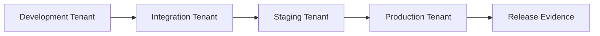

# Environment strategy

Environment strategy defines how Auth0 configuration moves from development to production while reducing drift and release risk.

## Recommended environments

| Environment | Purpose | Change control |
| --- | --- | --- |
| Development | Build and test new integrations | Lightweight review |
| Integration | Validate cross-system behavior | Pull request and automated validation |
| Staging | Production-like rehearsal | Approval required |
| Production | Live user authentication | Formal change control |

## Promotion flow

## Environment-specific values

Parameterize values that differ by environment:

- Tenant domain and custom domain.
- Callback URLs and logout URLs.
- API audiences.
- Secret references.
- Identity provider metadata.
- Log stream destinations.

## Drift management

Configuration drift happens when tenants are changed outside the promotion path. To control drift:

- Limit production dashboard access.
- Use source control as the expected configuration state.
- Export and compare tenant configuration regularly.
- Record emergency changes and reconcile them after resolution.

## Release gates

Before promotion to production, validate:

- Application callback and logout URLs.
- API audience and scopes.
- Token lifetime and refresh token settings.
- MFA and session settings.
- Log stream health.
- Rollback plan.

## Next steps

- Define [Configuration Promotion](../automation/configuration-promotion.md).
- Add release checks to [CI/CD](../automation/ci-cd.md).
