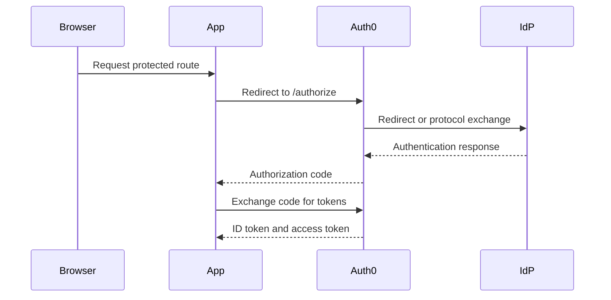
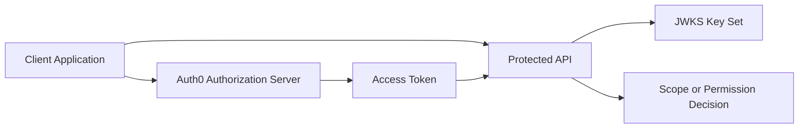
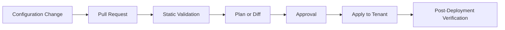
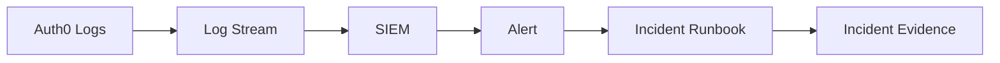

# Reference diagrams

This page stores reusable diagrams for enterprise Auth0 architecture, authentication flows, and operations. Keep diagrams in Mermaid so they are reviewable in source control.

## Authentication flow

## API authorization flow

## Configuration promotion flow

## Operations flow

## Diagram maintenance

- Keep diagrams focused on one decision or process.
- Prefer explicit component names over abstract boxes.
- Update diagrams in the same pull request as architecture changes.
- Avoid embedding secrets, tenant names, or internal-only URLs.
