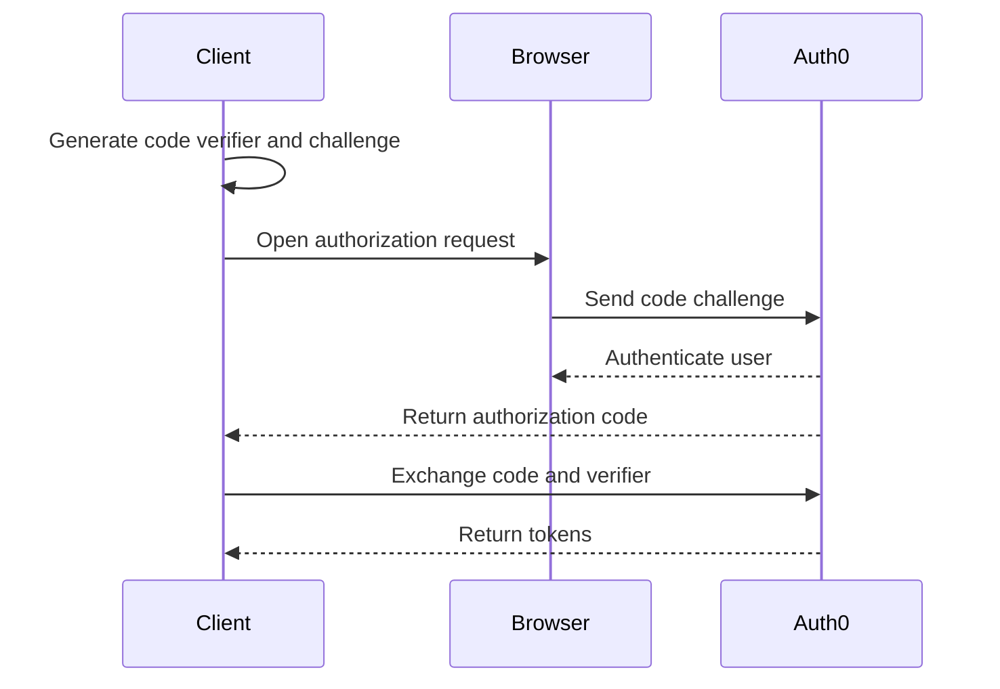

# Authorization Code with PKCE

Authorization Code with PKCE is the recommended flow for public clients such as single page, native, and mobile applications. PKCE protects the authorization code exchange when the client cannot safely store a client secret.

## Flow

## Configuration requirements

- Application type is Single Page Application, Native, or another public-client profile.
- Callback URLs are exact and environment-specific.
- Allowed web origins are configured for browser apps.
- Logout URLs are approved.
- Refresh token rotation is reviewed before enabling long-lived sessions.

## Implementation guidance

- Use an Auth0-supported SDK where possible.
- Use the system browser for native applications.
- Do not embed client secrets in browser or mobile clients.
- Store tokens according to platform security guidance.
- Renew tokens through supported SDK mechanisms rather than custom silent-auth workarounds.

## Validation checklist

- [ ] Authorization request includes a code challenge.
- [ ] Token request includes the matching code verifier.
- [ ] Redirect URI matches exactly.
- [ ] API audience and scopes are requested when needed.
- [ ] Logout clears the expected application session.
