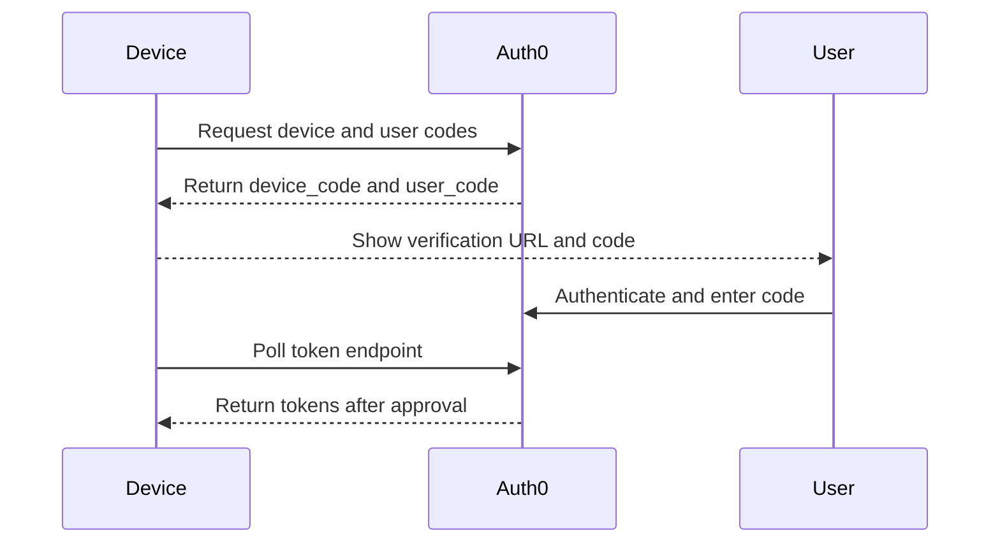

# Device Authorization

Device Authorization Flow supports devices and command-line tools that cannot easily collect user credentials through a browser-based redirect.

## When to use

Use this flow for:

- Smart TVs and shared devices.
- Command-line tools.
- Devices with limited keyboards.
- Industrial or kiosk-like scenarios where direct credential entry is impractical.

## Flow

## Security considerations

- Use short user code lifetimes.
- Avoid excessive polling.
- Display verification instructions clearly.
- Monitor failed verification attempts.
- Do not use this flow where a standard redirect flow is available and practical.

## Validation checklist

- [ ] User code expiry is acceptable for the scenario.
- [ ] Polling interval is respected.
- [ ] User cancellation is handled.
- [ ] Device displays only non-sensitive information.
- [ ] Logs capture failed and successful authorization events.
