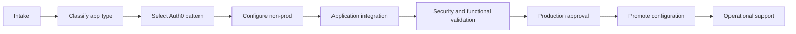

# Application Onboarding Solution

Application onboarding is the repeatable process for moving a new workload from intake to production Auth0 integration. The process should be the same whether the application is a SPA, server-side web app, mobile app, API, or Machine to Machine client, with type-specific controls.

## Onboarding lifecycle

## Intake form fields

| Field | Required information |
| --- | --- |
| Application name | Business name and technical service name |
| Owner | Business owner, technical owner, support team |
| Environment | Development, staging, production |
| App type | SPA, regular web, native/mobile, API, M2M, SAML app |
| User population | Workforce, customer, partner, service identity |
| Login method | Enterprise, database, social, passwordless, organization-specific |
| Callback URLs | Exact URLs for every environment |
| Logout URLs | Exact post-logout URLs |
| API access | Audiences and scopes required |
| Session needs | Idle timeout, absolute timeout, refresh token requirements |
| Compliance | Data residency, regulated data, audit needs |

## Onboarding by app type

### Single Page Application

Auth0 setup:

- Application type: Single Page Application.
- Flow: Authorization Code with PKCE.
- Configure callback URLs, logout URLs, and allowed web origins.
- Enable refresh token rotation only after security review.

Application responsibilities:

- Use Auth0 SPA SDK or approved OIDC library.
- Do not use client secrets.
- Request API audience only when calling protected APIs.
- Handle token renewal and login-required errors.

### Regular Web Application

Auth0 setup:

- Application type: Regular Web Application.
- Flow: Authorization Code.
- Configure client secret, callbacks, logout URLs, and allowed grant types.

Application responsibilities:

- Store client secret in a vault.
- Validate state and nonce through a trusted library.
- Manage server-side or secure encrypted sessions.
- Protect callback endpoint and logout behavior.

### Native and Mobile Application

Auth0 setup:

- Application type: Native Application.
- Flow: Authorization Code with PKCE.
- Configure platform redirect URIs.
- Review refresh token rotation.

Application responsibilities:

- Use system browser authentication.
- Store tokens in platform secure storage.
- Handle lost device, reinstall, and backup restore behavior.

### API Service

Auth0 setup:

- Create or reuse API/resource server.
- Define audience and scopes.
- Review token lifetime and RBAC setting.

API responsibilities:

- Validate JWT issuer, audience, signature, expiration, and scopes.
- Return clear 401 and 403 behavior.
- Avoid logging full tokens.

### Machine to Machine Client

Auth0 setup:

- Application type: Machine to Machine.
- Authorize client for specific APIs and scopes.
- Create environment-specific credentials.

Service responsibilities:

- Store client secret in a vault.
- Request tokens only as needed.
- Rotate credentials.
- Monitor token exchange errors.

## Production approval criteria

- Auth0 settings reviewed by identity platform team.
- Application integration reviewed by application owner.
- Token and session settings approved by security.
- Monitoring and support owners assigned.
- Rollback plan documented.
- Production configuration promoted through approved path.

## Onboarding evidence

Store:

- Intake form.
- Approved configuration diff.
- Test results.
- Security review notes.
- Production release record.
- Support and escalation contact.

## Checklist

- [ ] Application type is correctly classified.
- [ ] Auth0 settings are environment-specific.
- [ ] Integration pattern is approved.
- [ ] Token/session controls are reviewed.
- [ ] Monitoring is configured.
- [ ] Production release evidence is stored.
