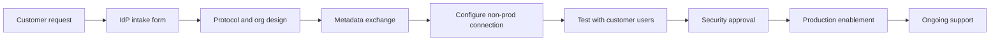

# Customer Identity Provider Onboarding

Customer identity provider onboarding lets B2B customers authenticate through their own IdP while your applications continue to use Auth0 as the application-facing identity layer.

## Supported onboarding models

| Model | Use when | Auth0 capabilities |
| --- | --- | --- |
| Customer SAML IdP | Customer has enterprise SAML | Enterprise SAML connection, Organizations, attribute mapping |
| Customer OIDC IdP | Customer supports modern OIDC | Enterprise OIDC connection, Organizations, claim mapping |
| Microsoft Entra ID | Customer uses Microsoft cloud identity | Azure AD/Entra enterprise connection or generic OIDC/SAML |
| Okta | Customer uses Okta | Okta OIDC or SAML enterprise connection |
| ADFS | Customer uses on-premises federation | SAML enterprise connection, certificate lifecycle tracking |
| Google Workspace | Customer uses Google identity | Google Workspace enterprise/social configuration depending on scenario |

## Onboarding lifecycle

## Customer intake fields

| Field | Description |
| --- | --- |
| Customer organization | Legal/customer account name and Auth0 Organization mapping |
| Protocol | SAML or OIDC |
| IdP owner | Customer technical contact and escalation path |
| Metadata | SAML metadata URL/file or OIDC issuer/client details |
| Signing certificate | Certificate and expiration date for SAML |
| Redirect or ACS URL | Auth0 endpoint provided to the customer |
| Required attributes | Email, name, immutable ID, groups, roles, tenant context |
| Assignment model | Whether users must be assigned in customer IdP |
| Test users | Named customer users for validation |
| Go-live date | Production activation window |

## Attribute mapping

Define mappings before production:

| Attribute | Recommended handling |
| --- | --- |
| Subject identifier | Use immutable provider ID where possible |
| Email | Use for communication, not sole authorization key |
| Name | Map for user experience only |
| Groups | Use only if stable and bounded; consider role translation |
| Organization | Prefer Auth0 Organization context over trusting free-form claims |

## Organization-specific routing

For B2B SaaS, associate the customer IdP connection with the customer Organization. This lets the login experience route users to the correct IdP based on organization context.

Application responsibilities:

- Send organization context when required.
- Handle IdP discovery or customer domain routing.
- Enforce organization membership server-side.
- Display support-friendly errors for unassigned users.

## Testing scenarios

- Assigned customer user can log in.
- Unassigned customer user is denied as expected.
- User missing required claims is handled correctly.
- Certificate or metadata mismatch produces visible operational error.
- Logout behavior is documented.
- Organization context appears in tokens or application session as designed.

## Ongoing support

Track:

- Certificate expiration.
- Metadata URL ownership.
- Customer technical contacts.
- Attribute mapping changes.
- IdP outage escalation path.
- Customer offboarding procedure.

## Checklist

- [ ] Customer organization is mapped.
- [ ] Protocol and metadata are documented.
- [ ] Attribute mappings are approved.
- [ ] Test users validated login and denial cases.
- [ ] Certificate lifecycle owner is assigned.
- [ ] Support escalation path is documented.
