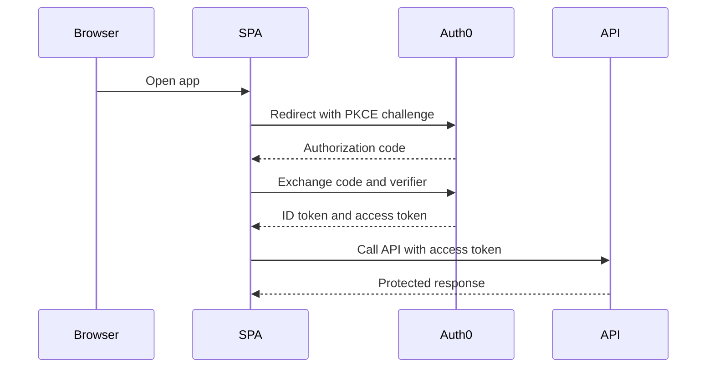

# Integration Patterns

Integration patterns define how applications, APIs, services, and identity providers connect to Auth0. Standard patterns reduce implementation risk and make support predictable.

## Pattern catalog

| Pattern | Auth0 configuration | Application responsibility |
| --- | --- | --- |
| SPA login | SPA application, Authorization Code with PKCE, callback/logout URLs | Use SDK, handle tokens safely, call APIs with access token |
| Server-side web login | Regular Web Application, Authorization Code, client secret | Store secret, manage server session, validate callback state |
| Mobile login | Native Application, PKCE, platform redirect | Use system browser, secure token storage, handle refresh |
| API protection | API/resource server, scopes, signing keys | Validate JWT and enforce scopes/permissions |
| Service-to-service | M2M application, client credentials, API scopes | Store secret, request token, rotate credentials |
| Enterprise federation | Enterprise connection, metadata, claims mapping | Route users, handle federation errors, map identity context |
| B2B organization login | Organizations, organization connections, invitations | Send org context, enforce tenant-aware authorization |
| Passwordless login | Email/SMS passwordless connection, Universal Login | Handle OTP or link UX and account linking decisions |
| SAML application | SAML add-on or SAML app integration | Validate assertion and map attributes |

## SPA integration pattern

Key controls:

- No client secret in frontend code.
- Exact callback URLs and allowed origins.
- Access token audience requested only when needed.
- Token storage approach approved by security.

## API protection pattern

APIs must validate tokens independently. A valid login session in an application is not enough.

Validation requirements:

- Issuer matches expected tenant or custom domain.
- Audience matches API identifier.
- Signature validates against JWKS.
- Token is not expired.
- Required scopes or permissions are present.

## B2B organization pattern

Use organization context when users belong to customers or partners.

Implementation requirements:

- Application passes organization context when required.
- Auth0 routes to organization-specific connections.
- Tokens include organization context when approved.
- APIs enforce tenant boundaries server-side.
- Offboarding removes membership and access.

## Integration acceptance checklist

- [ ] Pattern is selected and documented.
- [ ] Auth0 application/API/connection settings are reviewed.
- [ ] Security controls are implemented.
- [ ] Monitoring signals are defined.
- [ ] Support runbook is linked.
