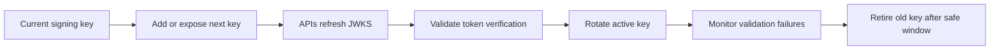

# Key Rotation

Key rotation covers Auth0 signing keys, application client secrets, enterprise IdP certificates, custom domain certificates, Management API credentials, and provider secrets. Rotation must be planned because identity keys and secrets are runtime dependencies.

## Rotation inventory

| Item | Used by | Rotation impact |
| --- | --- | --- |
| Auth0 signing keys | APIs validating JWTs | APIs must trust new JWKS key before old key is retired |
| Application client secrets | Regular Web Apps and M2M clients | Apps/services must deploy new secret before old secret is revoked |
| Management API credentials | Automation and CI/CD | Pipelines may fail if secret is rotated without update |
| SAML signing certificates | Enterprise connections and SAML apps | Federation may fail if metadata/certs are not exchanged |
| OIDC client secrets | Enterprise connections | Federation may fail until provider and Auth0 match |
| Custom domain certificates | User-facing login domain | Login endpoint availability may be affected |
| Email/SMS provider credentials | Communications and passwordless | Delivery may fail until provider credentials are updated |

## Signing key rotation pattern

## Client secret rotation pattern

1. Create replacement secret.
2. Store replacement in the secrets manager.
3. Deploy application or service using replacement secret.
4. Validate login or token exchange.
5. Revoke old secret.
6. Monitor authentication errors.
7. Record rotation evidence.

## Certificate rotation pattern

For SAML and custom domains:

- Identify certificate owner and expiry date.
- Generate or obtain replacement certificate.
- Exchange metadata with counterparties.
- Validate in non-production where possible.
- Schedule production rotation window.
- Monitor federation or domain errors.
- Keep rollback material available until stable.

## Rotation calendar

Maintain a calendar for:

- Auth0 signing keys.
- Application client secrets.
- Management API clients.
- SAML certificates.
- Custom domain certificates.
- Email and SMS provider credentials.
- Customer IdP certificates.

## Emergency rotation

Emergency rotation is required after suspected exposure. The process should prioritize containment over convenience, but still capture evidence.

Emergency record fields:

- Exposed key or secret type.
- Affected tenant, application, or connection.
- Time discovered.
- Containment action.
- Replacement action.
- Validation result.
- Follow-up corrective actions.

## Checklist

- [ ] All keys, secrets, and certificates are inventoried.
- [ ] Owners and expiry dates are recorded.
- [ ] Rotation runbooks exist by credential type.
- [ ] Applications and APIs support safe rollover.
- [ ] Emergency rotation path is tested.
