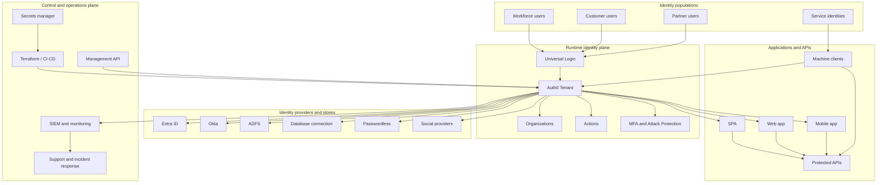

# Reference Architecture

This reference architecture shows how Auth0 capabilities fit into an enterprise identity platform across runtime authentication, administrative control, automation, and operations.

## Architecture view

## Architecture planes

| Plane | Auth0 components | Owner |
| --- | --- | --- |
| Runtime identity | Universal Login, connections, Actions, MFA, sessions, tokens | Identity platform and application teams |
| Access management | APIs, scopes, roles, permissions, organizations | Identity platform, API owners, security |
| Customer and user lifecycle | Users, organizations, invitations, SCIM, account recovery | Product, support, identity platform |
| Control plane | Dashboard, Management API, Terraform, CI/CD, secrets | Platform automation and identity platform |
| Operations plane | Logs, log streams, alerts, support, incidents, compliance evidence | SRE, security operations, support |

## Core design principles

- Use Auth0 as the application-facing identity broker and authorization server.
- Keep upstream identity provider complexity behind Auth0 connections.
- Use Organizations for B2B tenant context, not separate Auth0 tenants for every customer unless isolation requires it.
- Use APIs/resource servers to represent protected API audiences.
- Use Actions only for identity-flow customization, not general application business logic.
- Stream logs to enterprise monitoring before production onboarding.
- Promote configuration through CI/CD instead of direct production dashboard changes.

## High availability considerations

- Keep application session handling resilient to transient identity errors.
- Avoid login-path Actions that depend on fragile external services.
- Monitor IdP-specific outages separately from Auth0 tenant issues.
- Keep break glass tenant access independent from the primary workforce federation path.
- Test rollback for custom domains, certificates, Actions, and connection changes.

## Security boundaries

- Tenant boundary: separates runtime and administrative configuration.
- Organization boundary: represents B2B customer or partner context inside a tenant.
- Application boundary: separates client credentials, redirects, and grant types.
- API boundary: separates audiences and scopes.
- Connection boundary: separates identity sources and authentication policy.

## Architecture review checklist

- [ ] Tenant and environment model is approved.
- [ ] User populations and IdPs are mapped.
- [ ] Application types and flows are standardized.
- [ ] API audience and scope strategy is documented.
- [ ] Actions and custom claims are governed.
- [ ] Logs and alerting are production-ready.
- [ ] Break glass and support procedures are defined.
