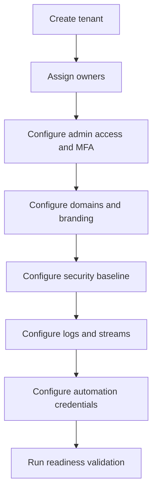

# Tenant Setup

Tenant setup establishes the baseline configuration for a new Auth0 environment. The goal is to create a tenant that is secure, observable, supportable, and ready for repeatable application onboarding.

## Tenant setup sequence

## Initial tenant settings

| Area | Setup task |
| --- | --- |
| Ownership | Assign primary owner, backup owner, support group |
| Admin access | Configure dashboard roles and administrator MFA |
| Naming | Apply tenant and environment naming standard |
| Domains | Configure custom domain strategy where required |
| Branding | Apply baseline Universal Login branding |
| Connections | Create approved baseline connections only |
| Applications | Create standard test apps and platform automation apps |
| APIs | Create initial platform APIs only when needed |
| Actions | Deploy baseline Actions only after review |
| Logs | Configure log streams and monitoring destinations |
| Security | Configure MFA, attack protection, session, and token baseline |
| Automation | Create least-privilege Management API clients for CI/CD |

## Environment-specific setup

| Environment | Guidance |
| --- | --- |
| Development | Allow experimentation but keep secrets and logs controlled |
| Integration | Mirror production patterns and validate automation |
| Staging | Production-like settings, release rehearsal, security validation |
| Production | Restricted access, approved changes only, monitored continuously |

## Baseline validation

- Administrator login requires MFA.
- Test application can complete login.
- Test API can validate token audience and signature.
- Log stream receives authentication and admin events.
- Custom domain resolves and uses expected certificate.
- Automation client can perform approved read/write tasks only.
- Emergency access procedure is documented.

## Tenant handover package

At the end of setup, produce:

- Tenant inventory record.
- Owner and support matrix.
- Baseline configuration export.
- Security control evidence.
- Log stream validation evidence.
- Automation credential record in vault.
- Known exceptions and follow-up actions.

## Checklist

- [ ] Tenant ownership is assigned.
- [ ] Admin MFA and roles are configured.
- [ ] Custom domain and branding are configured or deferred with owner.
- [ ] Logs stream to monitoring.
- [ ] Security baseline is applied.
- [ ] Automation credentials are least privilege.
- [ ] Handover package is complete.
