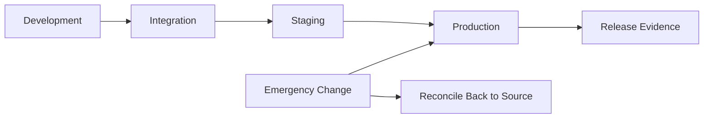

# Configuration promotion

Configuration promotion moves validated Auth0 changes from lower environments to production. It is the backbone of enterprise identity governance because it controls how tenant changes are reviewed, approved, applied, and verified.

## Promotion objectives

- Reduce production drift.
- Make identity changes reviewable before release.
- Keep environment-specific values explicit.
- Prevent dashboard-only production changes from becoming permanent surprises.
- Capture evidence for operations and compliance.

## Promotion model

## What should be promoted

| Resource | Promotion guidance |
| --- | --- |
| Applications | Promote type, grant settings, callbacks, logout URLs, origins, metadata |
| APIs | Promote identifiers, scopes, token settings, RBAC settings |
| Connections | Promote configuration carefully; provider metadata may vary by environment |
| Actions | Promote source-controlled code, dependency versions, and trigger bindings |
| Organizations | Automate when lifecycle volume is high or customer onboarding requires it |
| Log streams | Promote destinations and health checks with environment-specific parameters |

## Environment-specific parameters

Keep these values outside reusable baseline configuration:

- Tenant domain.
- Custom domain.
- Callback and logout hostnames.
- API audiences if they differ by environment.
- Identity provider metadata and certificates.
- Secrets and secret references.
- Log stream destinations.

## Standard promotion process

1. Create or update configuration in source control.
2. Open a pull request with scope, risk, and validation notes.
3. Run static validation and policy checks.
4. Apply to development or integration.
5. Validate login, token, and log behavior.
6. Promote to staging for production-like testing.
7. Obtain production approval.
8. Apply to production.
9. Run post-deployment verification.
10. Store release evidence.

## Required pull request information

Every promotion pull request should include:

- Affected tenant and environment.
- Affected applications, APIs, connections, or Actions.
- User impact.
- Security impact.
- Validation plan.
- Rollback plan.
- Evidence location after deployment.

## Drift handling

When drift is detected:

1. Classify the drift as emergency, authorized manual, or unauthorized.
2. Decide whether to keep, revert, or replace the live setting.
3. Reconcile accepted changes back into source control.
4. Review why the normal promotion path was bypassed.
5. Add a control if the drift indicates a repeatable gap.

## Emergency changes

Emergency production changes are allowed only when the incident impact justifies bypassing the normal process. They must still be documented.

Emergency records should include:

- Incident or change ticket.
- Approver.
- Exact setting changed.
- Time changed.
- Validation result.
- Follow-up pull request to reconcile configuration.

## Validation checklist

- [ ] Source-controlled configuration matches intended state.
- [ ] Environment parameters are separated from reusable configuration.
- [ ] Non-production validation completed.
- [ ] Production approval recorded.
- [ ] Post-deployment verification completed.
- [ ] Release evidence stored.
- [ ] Any emergency changes reconciled.
