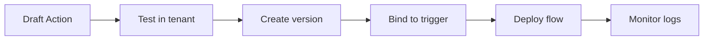

# Action Triggers and Runtime

Auth0 Actions are versioned, tenant-specific Node.js functions that execute at supported trigger points in Auth0 flows. Use them for targeted customization, not as a general application backend.

## Common trigger areas

| Trigger area | Typical use |
| --- | --- |
| Post Login | Add custom claims, enforce policy, normalize profiles, deny access |
| Machine to Machine | Add service claims or enforce client credential policy |
| Pre User Registration | Validate or enrich signup input before user creation |
| Post User Registration | Notify downstream systems after signup |
| Password Reset | Integrate account recovery events where supported |
| Credentials Exchange | Customize token exchange behavior where supported |

## Action lifecycle

## Runtime considerations

- Actions run in Auth0-managed runtime environments.
- Actions are versioned; deployed versions should be traceable to source control.
- Secrets should be stored as Action secrets.
- Dependencies should be reviewed and pinned where possible.
- External calls add latency and failure risk to authentication flows.
- Errors can affect login, token issuance, or user lifecycle behavior depending on trigger.

## Claim customization

When adding custom claims:

- Use a consistent custom claim namespace where required.
- Add only claims consumed by applications or APIs.
- Keep claim values compact.
- Avoid sensitive personal or security data unless approved.
- Document the source and owner of every custom claim.

## Failure handling

Design every Action with failure behavior in mind:

| Failure | Expected design response |
| --- | --- |
| External API timeout | Fail closed or fail open based on risk decision |
| Missing user metadata | Use safe default or deny with clear error |
| Secret unavailable | Stop deployment or fail authentication as designed |
| Unexpected exception | Log minimal context and avoid leaking secrets |

## Validation checklist

- [ ] Trigger, purpose, and owner are documented.
- [ ] Source code is reviewed.
- [ ] Secrets are stored as Action secrets.
- [ ] External dependencies have timeout behavior.
- [ ] Real-time logs or tenant logs are monitored after release.
