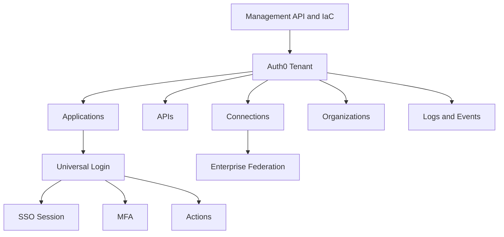

# Core Auth0 feature overview

Auth0 is an identity platform made up of authentication, authorization, user management, federation, extensibility, security, monitoring, and automation capabilities. This section explains the product features that enterprise teams must understand before designing implementation and operations standards.

## Capability map

| Capability | What it provides | Enterprise use |
| --- | --- | --- |
| Tenants | Runtime and administration boundary | Separate environments, ownership, release controls, and audit scope |
| Applications | Client configuration for workloads | Standardize SPA, web, mobile, native, and service integrations |
| APIs | Protected resource and token audience definitions | Issue access tokens and enforce scopes or permissions |
| Connections | User stores and identity providers | Support database, enterprise, social, passwordless, SAML, and OIDC login |
| Universal Login | Auth0-hosted login experience | Centralize login UX, MFA, federation, password reset, and branding |
| SSO | Session continuity across applications | Reduce repeated sign-in while preserving security controls |
| Organizations | B2B customer or partner boundaries | Model tenants, memberships, invitations, and identity provider routing |
| Actions | Extensibility for Auth0 flows | Add claims, enforce policy, normalize profiles, and integrate services |
| MFA | Additional authentication factors | Protect administrators, high-risk apps, and sensitive operations |
| Attack protection | Controls against common identity attacks | Detect or reduce credential stuffing, brute force, and breached password risk |
| Logs and events | Authentication and administration telemetry | Troubleshoot, monitor, investigate, and produce audit evidence |
| Management API | Administrative automation surface | Inventory, configure, validate, migrate, and report at scale |

## How features fit together

## Enterprise interpretation

Auth0 features should not be enabled one at a time without a platform model. For each feature, define:

- Who owns configuration and support.
- Which environments use the feature.
- Which applications can use it.
- What security controls apply.
- How changes are promoted.
- What events are monitored.
- What evidence is retained.

## Recommended reading path

1. Read [Tenant and Dashboard](tenant-dashboard.md) to understand platform boundaries.
2. Read [Universal Login and SSO](universal-login-sso.md) for the user-facing login layer.
3. Read [Authentication Methods](authentication-methods.md) and [Authorization and RBAC](authorization-rbac.md) for core runtime behavior.
4. Read [Actions and Extensibility](actions-extensibility.md) for customization points.
5. Read [Security and Attack Protection](security-attack-protection.md) and [Logs, Events, and Monitoring](logs-events-monitoring.md) before production.
