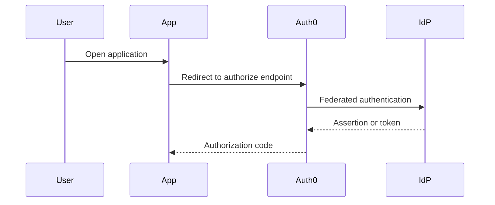

# Documentation standards

This guide uses a task-oriented documentation model inspired by large cloud documentation sets. Pages should help readers make decisions, perform configuration, validate outcomes, and operate the platform.

## Content types

| Type | Purpose | Typical sections |
| --- | --- | --- |
| Concept | Explain a platform idea or design decision | Overview, design principles, options, tradeoffs |
| Task | Guide a user through implementation | Prerequisites, procedure, validation, rollback |
| Reference | Provide lookup information | Tables, field definitions, examples, limits |
| Runbook | Support operations and incidents | Triggers, severity, steps, escalation, evidence |
| Pattern | Describe a reusable architecture | Scenario, architecture, implementation notes, risks |

## Required structure for task pages

Use this structure unless the page is clearly reference-only:

```markdown
# Page title

Brief summary.

## When to use this guidance

## Prerequisites

## Design considerations

## Procedure

## Validation

## Rollback or recovery

## Next steps
```

## Writing style

- Use sentence case for headings.
- Lead with the decision or action.
- Prefer short paragraphs, tables, and checklists.
- Use active voice.
- Name owners and systems explicitly.
- Avoid vague phrases such as "properly configured" unless you define the required state.

## Admonitions

Use admonitions sparingly and consistently:

```markdown
!!! note
    Helpful context that affects understanding.

!!! warning
    Risk that could cause misconfiguration, outage, or security exposure.

!!! danger
    High-risk action that could create a severe security or availability issue.
```

## Diagram standard

Use Mermaid for diagrams so source control diffs remain readable.



## Page acceptance checklist

- [ ] The page has a clear audience and outcome.
- [ ] Required prerequisites are named.
- [ ] Security and operational implications are included.
- [ ] Examples use placeholders, not real secrets or tenant data.
- [ ] Diagrams use Mermaid.
- [ ] Links resolve in `mkdocs build --strict`.
