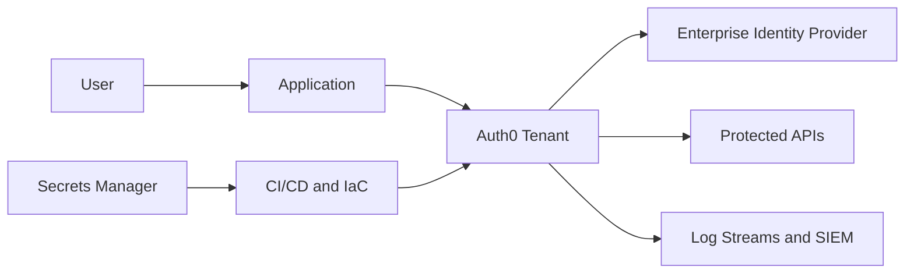

# Enterprise Auth0 Guide

Use this guide to plan, implement, secure, automate, and operate Auth0 as an enterprise identity platform.

This documentation is organized for platform teams that need repeatable decisions, clear implementation patterns, and operational controls. It intentionally separates architecture, configuration, implementation, security, and operations so teams can use the guide as both an adoption playbook and a long-term reference.

## Audience

This guide is written for:

- Identity platform engineers who administer Auth0 tenants and shared identity services.
- Security architects who define authentication, authorization, and monitoring controls.
- Application teams that integrate web, mobile, API, and service workloads.
- Operations teams that own release, monitoring, incident response, and audit evidence.
- Governance teams that review access, compliance posture, and control effectiveness.

## Enterprise adoption model

1. Define tenant, environment, domain, and ownership models.
2. Configure foundational resources such as applications, APIs, connections, organizations, and Universal Login.
3. Standardize application authentication flows and API authorization requirements.
4. Federate enterprise identity providers and lifecycle systems.
5. Apply security controls for MFA, RBAC, tokens, sessions, and secrets.
6. Automate configuration, release, validation, monitoring, and evidence capture.

## Reference architecture

## How to use this guide

Start with architecture if you are designing a new platform. Start with implementation if you are integrating a single workload into an existing tenant. Start with operations if you already run Auth0 and need stronger governance, monitoring, and deployment discipline.

| Goal | Start here |
| --- | --- |
| Understand Auth0 core capabilities | [Core Auth0 feature overview](core-features/overview.md) |
| Design a new enterprise Auth0 platform | [Enterprise Architecture](architecture/enterprise-architecture.md) |
| Choose a tenant and environment model | [Tenant Strategy](architecture/tenant-strategy.md) |
| Integrate a browser app | [Single Page Applications](implementation/spa.md) |
| Protect APIs | [API Authorization](security/api-authorization.md) |
| Federate corporate identity | [Enterprise Federation Overview](enterprise-federation/overview.md) |
| Automate configuration | [Configuration Promotion](automation/configuration-promotion.md) |

## Operating principles

- Treat identity configuration as production infrastructure.
- Prefer source-controlled, reviewed, and repeatable changes.
- Keep application integration patterns small, documented, and reusable.
- Monitor authentication events as security signals, not just application telemetry.
- Validate token, session, MFA, and authorization settings before production release.

## Next steps

- Read [Overview](getting-started/overview.md) for the adoption path.
- Review [Core Auth0 feature overview](core-features/overview.md) to understand the product capability map.
- Review [Documentation Standards](getting-started/documentation-standards.md) before adding new pages.
- Use [Configuration Checklist](reference/configuration-checklist.md) before production launch.

