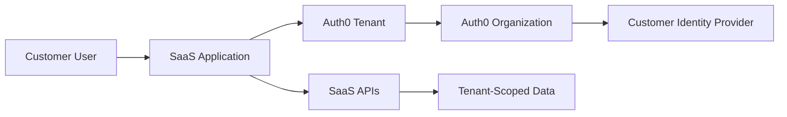

# Multi-Tenant SaaS

Multi-tenant SaaS architectures often use Auth0 Organizations to represent customer tenants. The pattern supports organization-aware login, membership, branding, identity provider routing, and authorization.

## Pattern architecture

## Design decisions

- One Auth0 Organization per customer, partner, or account.
- Whether customers can bring their own identity provider.
- Whether organization branding is customer-managed or centrally managed.
- How organization roles map to application permissions.
- How tenant identifiers are represented in tokens and audit logs.

## Implementation guidance

- Use stable organization IDs for authorization and audit correlation.
- Keep display names separate from permanent identifiers.
- Validate organization membership on protected operations.
- Treat organization metadata as controlled configuration.
- Monitor failed organization login routing.

## Risks

- Confusing Auth0 tenant boundaries with SaaS customer tenant boundaries.
- Using email domain as the only customer routing control.
- Failing to validate tenant context server-side.
- Letting stale organization memberships persist after customer offboarding.

## Validation checklist

- [ ] Organization membership is enforced.
- [ ] Customer identity provider routing is tested.
- [ ] Tenant context is available to APIs.
- [ ] Offboarding process removes or disables access.
