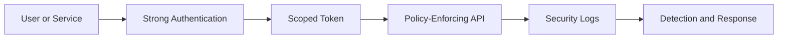

# Zero Trust

Zero trust identity patterns require continuous verification, least privilege, strong telemetry, and explicit authorization. Auth0 is one control point in a broader zero trust architecture.

## Identity controls

- Strong authentication with MFA for risky scenarios.
- Short-lived access tokens.
- Server-side API authorization.
- Least-privilege scopes and roles.
- Centralized logs and alerting.
- Regular review of privileged access.

## Architecture considerations

## Implementation guidance

- Treat network location as a signal, not proof of trust.
- Validate every API request.
- Use risk-based controls where available.
- Avoid long-lived broad tokens.
- Monitor anomalous authentication and authorization activity.

## Validation checklist

- [ ] APIs enforce authorization server-side.
- [ ] Privileged operations require stronger controls.
- [ ] Logs support investigation.
- [ ] Token lifetimes align with risk.
- [ ] Access reviews cover privileged roles.
