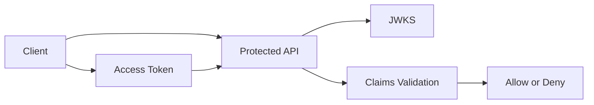

# API authorization

APIs must validate access tokens and enforce authorization before returning protected data or performing privileged operations.

## Required token validation

Every protected API must validate:

- Signature using the trusted JSON Web Key Set.
- Issuer matches the expected Auth0 tenant or custom domain.
- Audience matches the API identifier.
- Expiration has not passed.
- Required scopes or permissions are present.

## Authorization flow

## Implementation requirements

- Use maintained JWT validation middleware or libraries.
- Cache JWKS keys according to library guidance.
- Reject unsigned tokens and unexpected algorithms.
- Log authorization failures without exposing token contents.
- Separate authentication failure from authorization denial in observability.

!!! danger
    Never trust client-side authorization checks as the only control for API access.

## Validation checklist

- [ ] Requests without tokens are rejected.
- [ ] Tokens with the wrong audience are rejected.
- [ ] Expired tokens are rejected.
- [ ] Missing scopes produce expected denial.
- [ ] Logs contain enough context to troubleshoot without storing secrets.
