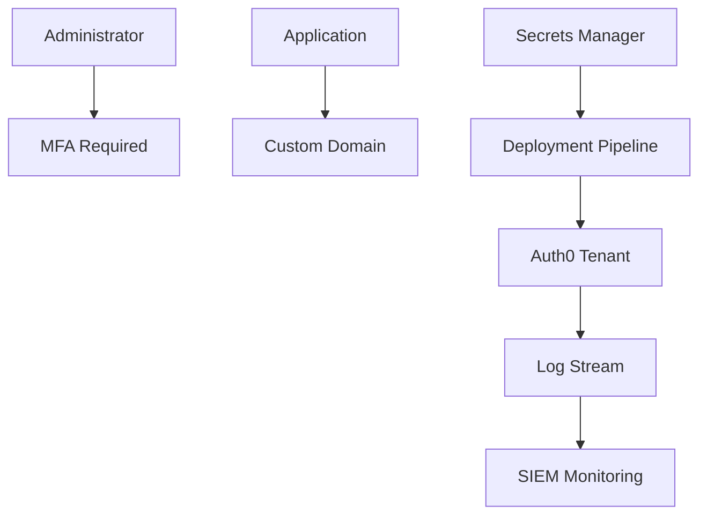

# Security baseline

The security baseline defines mandatory controls for enterprise Auth0 tenants and integrations. Apply the baseline before onboarding production applications.

## Required controls

| Control | Requirement |
| --- | --- |
| Administrator MFA | MFA required for all production administrators |
| Least privilege | Dashboard roles assigned by job responsibility |
| Custom domain | Required for production user-facing applications where applicable |
| Log streaming | Production logs streamed to monitored destination |
| Token validation | APIs validate issuer, audience, signature, expiration, and permissions |
| Secrets management | Client secrets and automation credentials stored in approved vaults |
| Change control | Production changes reviewed and traceable |
| Break glass | Emergency access documented, protected, and monitored |

## Baseline architecture

## Review cadence

| Review | Frequency |
| --- | --- |
| Administrator access | Quarterly |
| Application inventory | Quarterly |
| Client secret rotation | Per policy or risk tier |
| Log stream health | Continuous monitoring |
| Token and session settings | Before production onboarding and annually |
| Break glass access | Quarterly and after every use |

## Exceptions

Security exceptions must include:

- Business justification.
- Risk owner.
- Compensating controls.
- Expiration date.
- Review schedule.

## Production readiness checklist

- [ ] Administrator MFA is enforced.
- [ ] Dashboard access is least privilege.
- [ ] Log streaming is operational.
- [ ] APIs validate tokens.
- [ ] Secrets are stored in the approved manager.
- [ ] Emergency access is documented.
